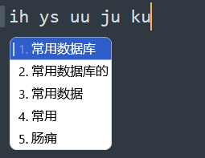

# rime_config
rime config

自定义了一些皮肤和style配置，单行 竖排输入 竖排输入效率更高 小鹤双拼

- 依赖 https://github.com/iDvel/rime-ice
- 配置文件目录 `C:\Users\admin\AppData\Roaming\Rime`

1. https://github.com/iDvel/rime-ice 文件放到 `C:\Users\admin\AppData\Roaming\Rime` 文件下
2. 该仓库的yaml文件 覆盖放到 配置文件目录
3. 拼自定义词典的文件 custom_phrase_double.txt