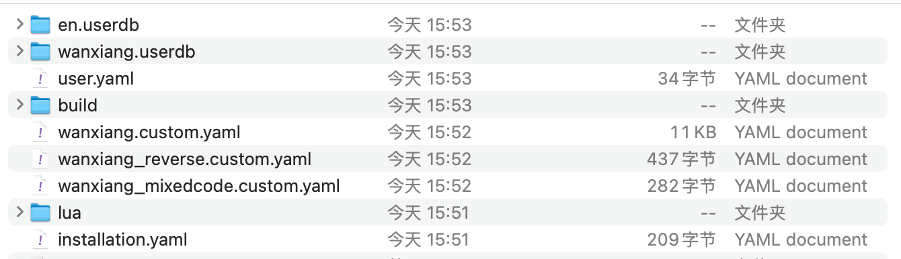

发现一个输入长句子更好用的万象输入法方法 部署更简单

[万象输入法方案](https://github.com/amzxyz/rime_wanxiang)

1. 复制 `wanxiang-lts-zh-hans.gram` 文件 到rime配置路径下
2. 解压 `rime-wanxiang-base.zip` 文件 放到rime 配置路径下
3. 重新部署

1. 将 squirrel.yaml 配置文件 复制过去 在里面修改皮肤样式

### windows系统使用另外的配置

将 weasel.custom.yaml weasel.style.yaml 文件移动到 配置目录下，使用自己的皮肤

### 常用的表情符号

标签，🏷
火箭 🚀
火焰 🔥
对号 ✅
错误 ❌
灯泡 💡
微笑 😊
闪光 ✨
拥抱 🤗
靶心 🎯
大拇指 赞 👍
开心 😄
谢谢 拜托 🙏
不看 🙈
时间 🕐
看 👀
小红书 📕
恭喜 🎉
画画 🎨
中 🀄
思考 🤔
注意 ⚠️
感叹号 ❗
铃铛 🔔
脑子 🧠
工具 🛠
放大镜 🔍
沙漏 ⌛
终点 🏁
逆时针 🔄
上升 📈
下降 📉
图表 📊
喇叭 📢
备忘 📝
红心 ♥️
